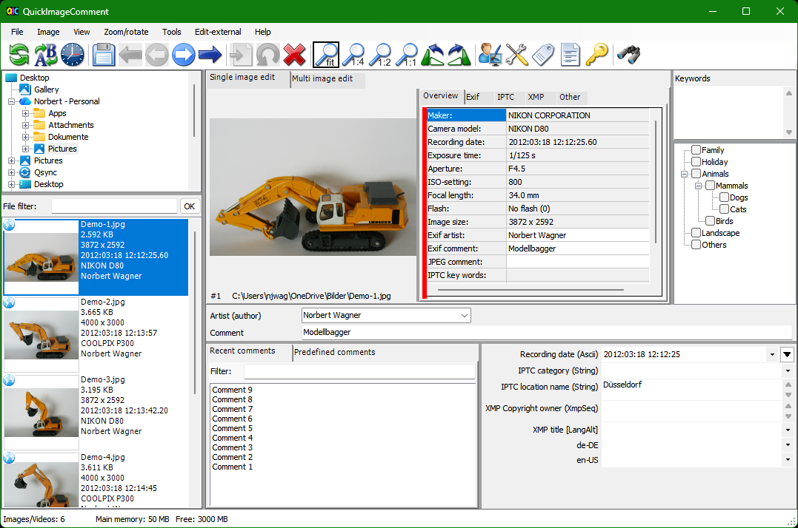

  
 QuickImageComment
=================

  

QuickImageComment displays EXIF, IPTC, and XMP properties of digital images (e.g., JPEG and TIFF as well as some RAW formats) and allows to edit them. These attributes are read from the EXIF, IPTC, and XMP properties of the image and are stored there. Especially editing of user comment and artist (author) is supported by using the last entered or predefined values. Metadata (XMP) in video files are displayed.

### Overview of features:
* Display of all EXIF, IPTC and XMP properties of images, as well as some other file properties such as modification date.
* Display of meta data (XMP) of video files as well as (depending on the Windows version and, if necessary, installed components) display a frame of the video.
* Images or videos can be searched via their properties and recording location on map.
* In addition to the full lists of EXIF, IPTC and XMP properties a list of properties is displayed, which is configurable.
* In addition to user comment and artist further EXIF, IPTC and XMP properties can be changed. The list of modifiable properties can be configured. 
* Data templates can be defined to set several properties in one step.
* Via placeholder it is possible to copy values of properties in others.
* Changes can be carried out simultaneously for two or more files.
* EXIF, IPTC and XMP properties can be deleted, thereby exceptions can be defined. Single properties can be deleted selectively.
* Files can be renamed using Exif, IPTC and XMP properties.
* The EXIF, IPTC and XMP properties contained in the files can be compared.
* A special mask is used to synchronize the recording time of a set of images taken with different cameras. Images are grouped by properties (mostly camera model). For each group, a shift of the recording time can be entered. Then the images are immediately sorted in order to check whether the images are then in the correct timely order.
* Selected image properties of all images/videos in a folder (including any subfolders) can be exported to a text file.
* All image properties of selected images/videos can be exported to text files (one file per image).
* Display of image details with graphical and numerical representation of brightness and RGB values.
* Display recording location in a map using the GPS coordinates; change of coordinates by selecting a position on the map.

Further processing of the images (e.g., adjusting the contrast and brightness) is not the purpose of this program.
For reading and changing the EXIF, IPTC, and XMP properties the library exiv2 is used. On www.exiv2.org a description of this library can be found as well as extensive information and links to Exif, IPTC and XMP. The formats supported by exiv2 are documented here:
* Images: http://dev.exiv2.org/projects/exiv2/wiki/Supported_image_formats
* Videos: http://dev.exiv2.org/projects/exiv2/wiki/Supported_video_formats

To display RAW images, a codec from the camera manufacturer may need to be installed. As an alternative, the Microsoft Raw Image Extension can be installed, which supports various RAW formats. However, with the camera manufacturer's codec, the display could be faster. One can install a specific codec and the Microsoft Extension. The specific codec is then used for the corresponding images, for all others the Microsoft Extension.

The program runs under Microsoft Windows 7, 8 and 10 (Windows 11 not yet tested) and is available as 32-bit and 64-bit variant. German or English can be selected as the language.

QuickImageComment is free software; you can use it under the terms of the GNU General Public License as published by the Free Software Foundation.

On www.quickimagecomment.de you find further information and can download zip-files with the excecutable packages.

# Folder structure

Folder | Content
:--- | :---
docs | Documenation for programmers
exiv2Cdecl | C++ project for library exiv2 (copied from https://github.com/Exiv2/exiv2) with some minor adjustments
QuickImageComment | C# project for the program 
Translation | Base files for translation of GUI and tags
UserManual | User manual as Word document and PDF, subfolder with images used

# Build the program

The program is built using Visual Studio 2019. Two build options are available:

* __.Net 4.6.1 framework__  
This is the preferred option with all functionalities. The solution includes a reference to the project MSIXpackage for creating an MSIX package. As the project contains confidential information for signing, it is not included.
* __.Net 4.0 framework__  
This option is based on .Net 4.0 and is intended for systems without .Net 4.6.1, especially older versions of Windows. It does not support using AppCenter.ms which allows sending error reports and anonymous usage data.

The AppCenter secure Id is not included in the sources (to keep it secret). So when you build the program (and do not get a secure Id on your own), the program runs without AppCenter.ms.

The projects use NuGet packages. NuGet is configured with:    
Default package management format: PackageReference

Depending on the changes made, following steps may be needed:
* Update translation (see [README](Translation/README.md))
* Update user manual (see [README](UserManual/README.md))

